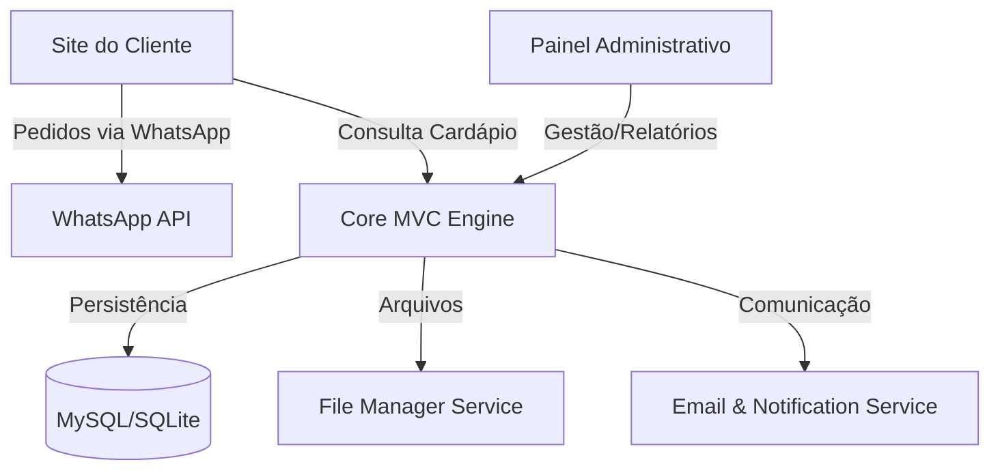

# 🍔 Tadalas Burguer - Gestão Inteligente para Hamburguerias


O **Tadalas Burguer** é um ecossistema digital completo projetado para modernizar a operação de hamburguerias artesanais. Indo além de um simples site de pedidos, o sistema integra um **PDV (Ponto de Venda)** robusto, gestão financeira, controle de estoque e análises de BI (Business Intelligence) em uma única plataforma unificada.

---

## 🏗️ Arquitetura e Engenharia

O projeto foi construído seguindo rigorosos padrões de engenharia de software, utilizando uma arquitetura **MVC (Model-View-Controller)** customizada que prioriza a separação de responsabilidades (SoC) e a manutenibilidade a longo prazo.

### 🧩 Visão Geral do Sistema



### Detalhes Técnicos
- **Roteamento:** Implementado via `bramus/router`, garantindo URLs amigáveis e desacopladas da estrutura física de arquivos.
- **Camada Core:** Conjunto de serviços utilitários para abstração de complexidade:
  - `FileManager`: Abstração para upload e manipulação segura de mídias.
  - `EmailService`: Integração com PHPMailer para notificações transacionais.
  - `Session & Flash`: Gerenciamento de estado e mensagens temporárias para UX fluida.
- **Segurança:** Validação de inputs através de classes especializadas e proteção contra ataques comuns.

---

## 🚀 Funcionalidades Principais

### 💼 Gestão Administrativa (Back-office)
- **PDV (Ponto de Venda) em Tempo Real:** Fluxo de pedidos organizado por status (Novo, Cozinha, Entrega, Finalizado).
- **Dashboard de Business Intelligence:** Visualização de KPIs (Faturamento, Ticket Médio, Top Produtos) com gráficos interativos via Chart.js.
- **Módulo Financeiro:** Gestão de despesas operacionais (`tbl_gastos`) integrada ao balanço de lucro real.
- **Gestão de Inventário:** Controle granular de produtos e insumos com alertas de estoque baixo.
- **Gestão de Pessoas:** Controle de permissões baseado em cargos e monitoramento de desempenho de funcionários.

### 📱 Experiência do Cliente (Front-end)
- **Cardápio Digital Interativo:** Interface mobile-first, otimizada para carregamento rápido e navegação intuitiva.
- **Carrinho Dinâmico:** Gestão de itens em tempo real com cálculo automático de totais.
- **Store Status:** Sincronização em tempo real do estado da loja (Aberta/Fechada/Pausada).

---

## 🛠️ Stack Tecnológica

### Backend
- **Core:** PHP 8.1+
- **Gerenciador de Dependências:** Composer
- **Rotas:** Bramus Router
- **Comunicação:** PHPMailer

### Frontend
- **Interface:** HTML5, CSS3 Moderno (Custom Properties, Flexbox, Grid)
- **Engine de Scripting:** JavaScript (ES6+)
- **Visualização de Dados:** Chart.js
- **UX/UI:** SweetAlert2 para interações críticas e FontAwesome 6 para iconografia.

---

## 📂 Estrutura de Diretórios

```text
Tadalas_Burguer/
├── assets/              # Assets estáticos (Images, CSS, JS)
├── backend/             # Enterprise Core
│   ├── Controllers/     # Lógica de aplicação e orquestração
│   ├── Core/            # Serviços base e abstrações do framework
│   ├── Database/        # Camada de abstração de dados (PDO)
│   ├── Models/          # Entidades de negócio e persistência
│   ├── Rotas/           # Definição de endpoints e middlewares
│   ├── Validadores/     # Lógica de integridade de dados
│   └── Views/           # Engine de templates administrativo
├── index.php            # Entrypoint principal (Client-facing)
├── cardapio.php         # Módulo de visualização de produtos
└── composer.json        # Manifest de dependências do projeto
```

---

## ⚙️ Configuração e Implantação

### Requisitos Mínimos
- PHP >= 8.1
- MySQL >= 5.7 ou SQLite3
- Módulo `mod_rewrite` habilitado no Apache

### Guia de Instalação Rápida
1. **Clone o Ambiente:**
   ```bash
   git clone https://github.com/usuario/tadalas-burguer.git
   cd tadalas-burguer
   ```
2. **Dependências:**
   ```bash
   composer install
   ```
3. **Persistência de Dados:**
   - Configure o `backend/Database/Config.php` com as credenciais do seu servidor.
   - Importe o backup do banco de dados utilizando o arquivo `Tadala_bancoDeDados.sql` na raiz do projeto.
   - (Opcional) Utilize o `setup_gastos.php` para inicialização financeira adicional se necessário.
4. **Deploy Local:**
   ```bash
   php -S localhost:8000
   ```

---

## 👨‍💻 Contribuição e Manutenção

Para manter a integridade do sistema, todas as contribuições devem seguir a PSR-12 para estilos de código. 

1. Faça um Fork do projeto.
2. Crie uma Branch para sua Feature (`git checkout -b feature/SuaInovacao`).
3. Comite suas mudanças (`git commit -m 'feat: Adiciona nova funcionalidade'`).
4. Push para a Branch (`git push origin feature/SuaInovacao`).
5. Abra um Pull Request.

---

## 📈 Roadmap
- [ ] Integração com Gateway de Pagamento (Pix API).
- [ ] Aplicativo Nativo para Entregadores.
- [ ] Sistema de Fidelidade e Cupons de Desconto.

---
**Desenvolvido com foco em excelência operacional por [Gues4hu/Victor Gabriel Almeida Prado Silva/ MATHEUS GOIS MAGALHAE].**
