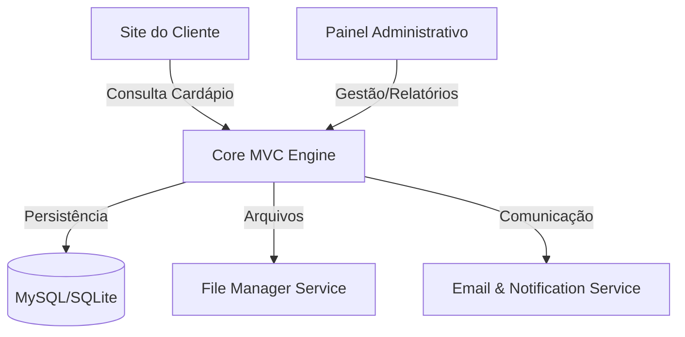

# 🍔 Tadalas Burguer - Gestão Inteligente para Hamburguerias


O **Tadalas Burguer** é um ecossistema digital completo projetado para modernizar a operação de hamburguerias artesanais. Indo além de um simples site de pedidos, o sistema integra um **PDV (Ponto de Venda)** robusto, gestão financeira, controle de estoque e análises de BI (Business Intelligence) em uma única plataforma unificada.

---

## 🏗️ Arquitetura e Engenharia

O projeto foi construído seguindo rigorosos padrões de engenharia de software, utilizando uma arquitetura **MVC (Model-View-Controller)** customizada que prioriza a separação de responsabilidades (SoC) e a manutenibilidade a longo prazo.

### 🧩 Visão Geral do Sistema



### Detalhes Técnicos
- **Roteamento:** Implementado via `bramus/router`, garantindo URLs amigáveis e desacopladas da estrutura física de arquivos.
- **Camada Core:** Conjunto de serviços utilitários para abstração de complexidade:
  - `FileManager`: Abstração para upload e manipulação segura de mídias.
  - `Session & Flash`: Gerenciamento de estado e mensagens temporárias para UX fluida.
- **Segurança:** Validação de inputs através de classes especializadas e proteção contra ataques comuns.

---

## 🚀 Funcionalidades Principais

### 💼 Gestão Administrativa (Back-office)
- **PDV (Ponto de Venda) em Tempo Real:** Fluxo de pedidos organizado por status (Novo, Cozinha, Entrega, Finalizado).
- **Dashboard de Business Intelligence:** Visualização de Funcionarios, Pedidos, Produtos.
- **Gestão de Inventário:** Criação de Produtos, Categorias.

### 📱 Experiência do Cliente (Front-end)
- **Cardápio Digital Interativo:** Interface mobile-first, otimizada para carregamento rápido e navegação intuitiva.
- **Carrinho Dinâmico:** Gestão de itens em tempo real com cálculo automático de totais.
- **Store Status:** Sincronização em tempo real do estado da loja (Aberta/Fechada/Pausada).

---

## 🛠️ Stack Tecnológica

### Backend
- **Core:** PHP 8.1+
- **Gerenciador de Dependências:** Composer
- **Rotas:** Bramus Router
- **Comunicação:** PHPMailer

### Frontend
- **Interface:** HTML5, CSS3 Moderno (Custom Properties, Flexbox, Grid)
- **Engine de Scripting:** JavaScript (ES6+)
- **Visualização de Dados:** Chart.js
- **UX/UI:** SweetAlert2 para interações críticas e FontAwesome 6 para iconografia.

---

## 📂 Estrutura de Diretórios

```text
Tadalas_Burguer/
├── assets/              # Assets estáticos (Images, CSS, JS)
├── backend/             # Enterprise Core
│   ├── Controllers/     # Lógica de aplicação e orquestração
│   ├── Core/            # Serviços base e abstrações do framework
│   ├── Database/        # Camada de abstração de dados (PDO)
│   ├── Models/          # Entidades de negócio e persistência
│   ├── Rotas/           # Definição de endpoints e middlewares
│   ├── Validadores/     # Lógica de integridade de dados
│   └── Views/           # Engine de templates administrativo
├── index.php            # Entrypoint principal (Client-facing)
├── cardapio.php         # Módulo de visualização de produtos
└── composer.json        # Manifest de dependências do projeto
```

---

## ⚙️ Configuração e Implantação

### Requisitos Mínimos
- PHP >= 8.1
- MySQL >= 5.7 ou SQLite3
- Módulo `mod_rewrite` habilitado no Apache
- Composer

### Guia de Instalação Rápida

1. **Clone o Repositório:**
   ```bash
   git clone https://github.com/usuario/tadalas-burguer.git
   cd tadalas-burguer
   ```

2. **Instale as Dependências:**
   ```bash
   composer install
   ```

3. **Configure o Ambiente:**
   - Crie um arquivo `.env` na raiz do projeto com as seguintes variáveis:
     ```env
     DB_HOST=localhost
     DB_NAME=tadala_db
     DB_USER=root
     DB_PASS=sua_senha
     DB_PORT=3306
     ```

4. **Importe o Banco de Dados:**
   - Crie um banco de dados MySQL chamado `tadala_db`
   - Importe o arquivo SQL:
     ```bash
     mysql -u root -p tadala_db < TesteSistemaBKP.sql
     ```

5. **Inicie o Servidor Local:**
   ```bash
   php -S localhost:8000
   ```

6. **Acesse o Sistema:**
   - **Site/Cardápio:** http://localhost:8000
   - **Painel Admin:** http://localhost:8000/backend/login

---

## 🧪 Usuários de Teste

O banco de dados já vem com usuários pré-cadastrados para facilitar os testes:

| Tipo | Nome | Email | Senha |
|------|------|-------|-------|
| 👑 **Administrador** | Admin | `testeAdmin@gmail.com` | `testeAdmin@gmail.com` |
| 👷 **Funcionário** | Funcionario | `testefuncionario@gmail.com` | `testefuncionario@gmail.com` |
| 👤 **Cliente** | cliente | `testecliente@gmail.com` | `testecliente@gmail.com` |

### Permissões por Tipo de Usuário

- **Administrador:** Acesso total ao painel administrativo, gestão de funcionários, relatórios financeiros e configurações do sistema.
- **Funcionário:** Acesso ao PDV, gestão de pedidos, visualização de cardápio e atualização de status de pedidos.
- **Cliente:** Acesso ao cardápio, carrinho de compras, histórico de pedidos e perfil pessoal.

---

## 🔧 Testando o Sistema

### Fluxo de Teste - Cliente
1. Acesse http://localhost:8000
2. Navegue pelo cardápio e adicione itens ao carrinho
3. Vá para o carrinho e faça login com `testecliente@gmail.com`
4. Selecione o tipo de pedido (Comer no Local, Retirar ou Delivery)
5. Escolha a forma de pagamento
6. Finalize o pedido

### Fluxo de Teste - Administrador
1. Acesse http://localhost:8000/backend/login
2. Faça login com `testeAdmin@gmail.com`
3. Explore o dashboard com gráficos e KPIs
4. Gerencie pedidos, produtos e funcionários

---


**Desenvolvido com foco em excelência operacional por [Gues4hu/Victor Gabriel Almeida Prado Silva/ MATHEUS GOIS MAGALHAE].**
